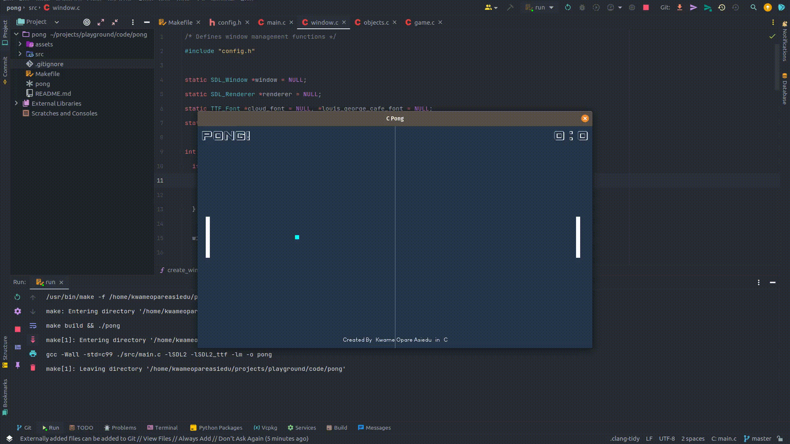

# C PONG GAME

My first graphics application written using **C** and **[SDL](https://www.libsdl.org/)**. The classic pong game!

## Running The Game

1. To run the project make the `pong` binary executable by running `chmod 744 pong`
2. Run `./pong` from the root of the directory

Enjoy!!!

## Building For Development

1. Make sure you have [Make](https://www.gnu.org/software/make/) installed on your system.
2. Make sure you have [SDL2](https://www.libsdl.org/) and [SDL2_ttf](https://wiki.libsdl.org/SDL2_ttf/FrontPage/)
   installed on your system.
3. Clone the project using `git clone https://github.com/kwameopareasiedu/c-pong`
4. Run `make build`to build the program.
5. Run `make run` to run the file,

## Contributors

- [Kwame Opare Asiedu](https://github.com/kwameopareasiedu)